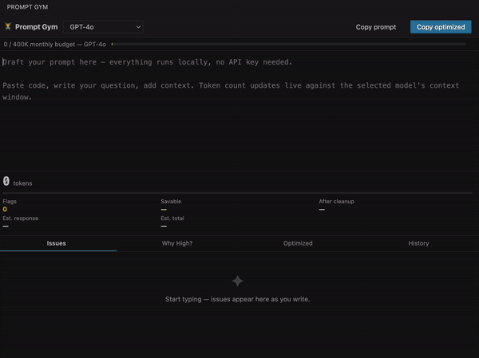
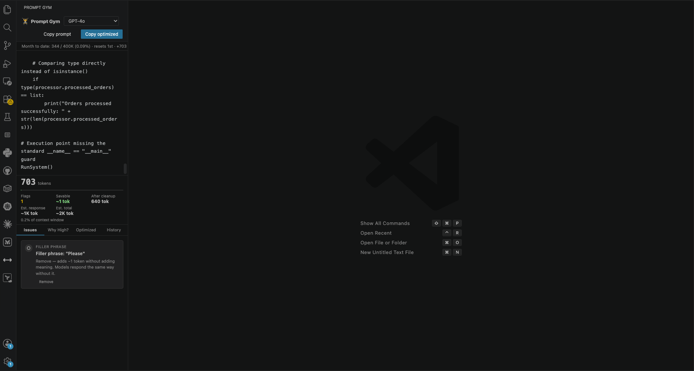
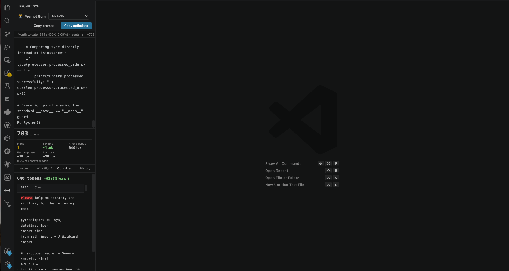
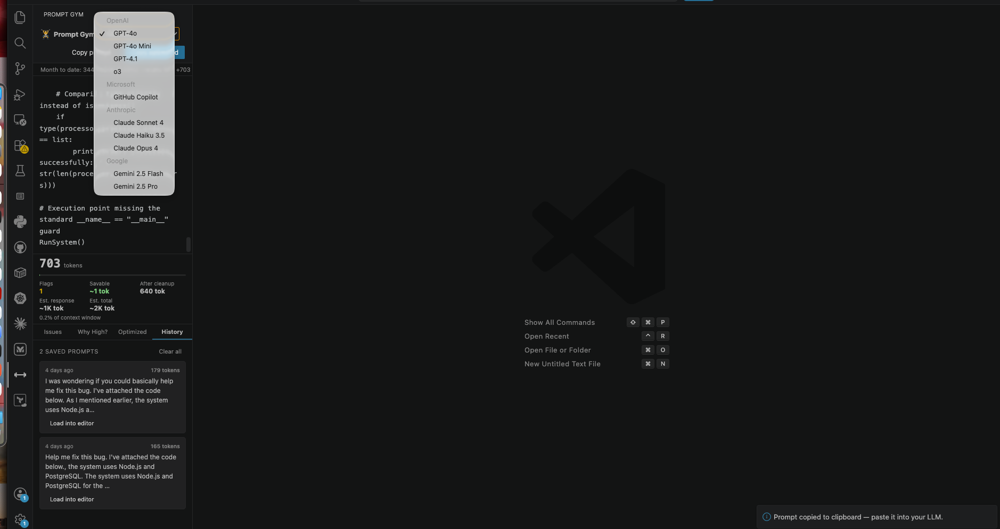

Built for ChatGPT, Claude, Gemini, Copilot, Cursor, Windsurf, and any LLM.

# Prompt Gym

Most prompt tools tell you **how many** tokens you used.

**Prompt Gym tells you what to remove.**

Draft, lint, optimize, and track prompts entirely offline before sending them to ChatGPT, Copilot, Claude, Gemini, or any LLM.

---

---

## Screenshots

---

## Built for restricted environments

Prompt Gym never sends prompts to external services.

- No API key
- No prompts leave your machine
- No cloud analysis
- Works completely offline

Ideal for enterprise environments where prompts can't leave your machine.

---

## Why Prompt Gym?

Unlike token counters that only measure prompts, Prompt Gym helps you improve them before you send.

✔ Finds filler phrases

✔ Detects repeated context

✔ Warns about oversized code snippets

✔ Shows exactly what changed

✔ Remembers similar prompts you've already sent

✔ Works completely offline

## What Prompt Gym catches

- Filler phrases that add tokens but not meaning
- Repeated context
- Oversized code snippets
- Duplicate prompts from your history
- Verbose instructions
- Structural repetition

---

## Don't ask the same question twice

Prompt Gym keeps a local history of your prompts.

If you're about to send something that's highly similar to a previous prompt, you'll get a warning before wasting tokens repeating yourself.

## How to use

1. Click the **barbell icon** in the activity bar (left sidebar) to open Prompt Gym.
2. Type or paste your prompt into the editor area.
3. The sidebar updates live — token count, flags, estimated response size, and monthly usage.
4. Fix issues with the inline **Remove** buttons, then **Copy prompt** to send it to your LLM.

**Copy vs Copy optimized**
- **Copy prompt** — copies the current draft as-is and saves it to history.
- **Copy optimized** — applies all removable flags first, then copies the cleaned version.

Either button is the "send" signal — Prompt Gym saves the prompt to history so future similar prompts trigger a similarity warning.

**Optimize Selection**
Select text in any file → right-click → **Prompt Gym: Optimize Selection** → choose to replace in editor, copy to clipboard, or open in the panel.

**Model selector**
Switch the tokenizer to match the model you're targeting:

| Model | Tokenizer |
|---|---|
| GPT-4o, GPT-4.1, o3, Copilot | o200k_base (exact) |
| GPT-4, GPT-3.5 | cl100k_base (exact) |
| Claude Sonnet / Haiku / Opus | cl100k_base (~95% accurate) |
| Gemini 2.5 Flash / Pro | cl100k_base (~95% accurate) |

---

## How Prompt Gym compares

| Feature | Token Counters | Prompt Gym |
|----------|---------------|------------|
| Live token count | ✅ | ✅ |
| Cost estimate | ✅ | 🚧 Planned |
| Filler phrase detection | ❌ | ✅ |
| Prompt similarity | ❌ | ✅ |
| Optimization diff | ❌ | ✅ |
| One-click cleanup | ❌ | ✅ |
| Offline | Varies | ✅ |

## Settings

Search `Prompt Gym` in VS Code Settings (`Cmd+,` / `Ctrl+,`):

| Setting | Default | Description |
|---|---|---|
| `promptGym.tokenizerModel` | `o200k_base` | Default tokenizer. Overridden by the model selector in the panel. |
| `promptGym.tokenWarningThreshold` | `2000` | Token count at which a warning flag appears. |
| `promptGym.pastedCodeTokenThreshold` | `300` | Flag code blocks larger than this many tokens. |
| `promptGym.monthlyTokenBudget` | `400000` | Monthly token target shown in the context bar. |
| `promptGym.semanticRedundancyThreshold` | `0.5` | Sensitivity for semantic duplicate detection (0.3 = more sensitive, 0.9 = only near-identical). |
| `promptGym.structuralRepeatThreshold` | `0.45` | Sensitivity for detecting closing paragraphs that repeat the opening. |

---

## Why offline?

Prompt Gym runs entirely inside VS Code and uses local tokenizers compatible with OpenAI and Claude models.

No data leaves your machine, there are no API costs, and no rate limits.

## Roadmap

- [ ] Token cost estimation
- [ ] Custom organization rules
- [ ] Prompt scoring
- [ ] Session-aware prompt memory
- [ ] Export/import prompt history